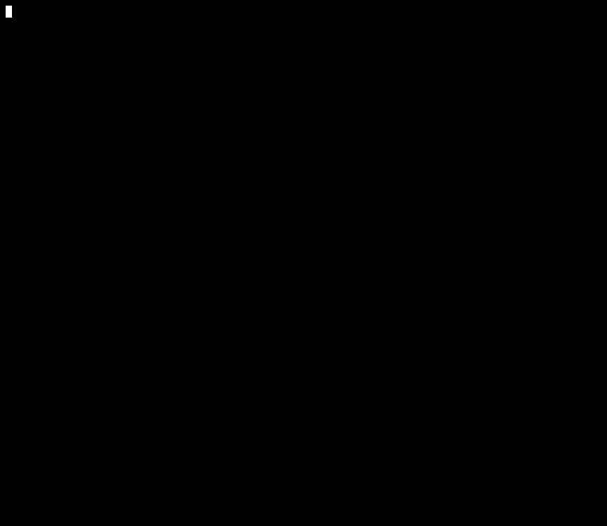

# termlight 🧑‍💻💡

[](https://github.com/kesyog/termlight/actions/workflows/build.yml)
[](https://crates.io/crates/termlight)
[](./LICENSE)

A bare-bones terminal app that displays an all-white screen. Intended to be run on a secondary
monitor (or two) during video calls as a cheap key/fill light.

Tested on a few Linux and Windows terminals and should work on any terminal/OS combination [supported by crossterm](https://github.com/crossterm-rs/crossterm#tested-terminals).



## Installation

Via [Cargo](https://rustup.rs):

```sh
$ cargo install termlight
```

## Usage

Just run the binary from your terminal:

```sh
$ termlight
```

Press nearly any key to exit. For maximum effect, turn up the brightness of your monitors.

## Alternatives

* Open about:blank or any predominantly-white page in your browser
* Buy a real lighting setup

## Disclaimer

This is not an officially supported Google product
